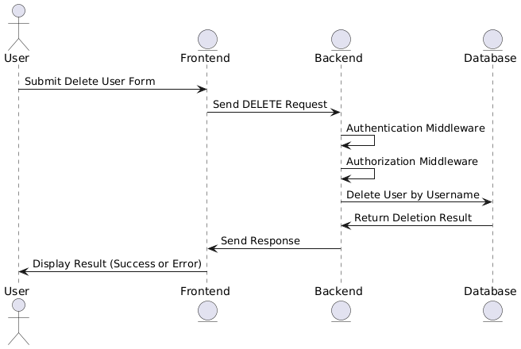

---

### Step 1: Understanding `deleteUsercombinedCode.js`

The `deleteUsercombinedCode.js` file combines backend and frontend functionalities for deleting a user after authentication. Here’s how each code snippet in the file works:

#### 1. **Backend Setup and Middleware**

```javascript
const express = require("express");
const bodyParser = require("body-parser");
const app = express();
const PORT = 4001;

app.use(bodyParser.json());

const authentication = (req, res, next) => {
  // Authentication logic here
  next();
};

const authorisation = ({ isAdmin }) => (req, res, next) => {
  // Authorisation logic here
  next();
};
```

- **Express Initialization**: The code initializes the Express framework to handle server requests and responses.
- **Body Parser Middleware**: `bodyParser.json()` is used to parse incoming request bodies in JSON format.
- **Authentication Middleware**: The `authentication` function simulates user authentication, allowing requests to proceed if the user is authenticated.
- **Authorization Middleware**: The `authorisation` function checks if the user has the correct permissions based on the `isAdmin` flag.

#### 2. **User Deletion Logic**

```javascript
const UserModel = {
  users: [
    { username: "john", email: "john@example.com" },
    { username: "jane", email: "jane@example.com" },
  ],
  destroy: async ({ where }) => {
    const index = UserModel.users.findIndex(user => user.username === where.username);
    if (index !== -1) {
      UserModel.users.splice(index, 1);
      return { success: true };
    }
    return { success: false, message: "User not found" };
  }
};

const delete_user_by_username = async (req, res) => {
  const { username } = req.body;
  try {
    const result = await UserModel.destroy({ where: { username } });
    if (result.success) {
      res.status(200).send(`User ${username} deleted successfully.`);
    } else {
      res.status(404).send(result.message);
    }
  } catch (error) {
    res.status(500).send("Server error occurred.");
  }
};
```

- **UserModel Simulation**: The `UserModel` object simulates a database model with a `destroy` method to delete users based on their username.
- **`delete_user_by_username` Function**: This function handles the logic for deleting a user by checking if the user exists and removing them if found. It returns appropriate responses based on the outcome.

#### 3. **Route Handling**

```javascript
app.post(
  "/auth/delete/user",
  authentication,
  authorisation({ isAdmin: false }),
  (req, res) => delete_user_by_username(req, res)
);
```

- **POST Route for User Deletion**: This route handles POST requests to `/auth/delete/user`. It applies the `authentication` and `authorisation` middleware to ensure the request is authenticated and authorized before calling `delete_user_by_username`.

#### 4. **Frontend Interaction**

```javascript
app.get("/", (req, res) => {
  res.send(`
    <!DOCTYPE html>
    <html lang="en">
    <head>
        <meta charset="UTF-8">
        <meta name="viewport" content="width=device-width, initial-scale=1.0">
        <title>Delete User</title>
    </head>
    <body>
        <h1>Delete User</h1>
        <form id="delete-user-form">
            <label for="other-username">Username to Delete:</label>
            <input type="text" id="other-username" name="other-username" required>
            <button type="submit">Delete User</button>
        </form>
        <script>
            document.getElementById("delete-user-form").addEventListener("submit", async (event) => {
                event.preventDefault();
                const username = document.getElementById("other-username").value;
                const response = await fetch(\`http://localhost:4001/auth/delete/user\`, {
                    method: "POST",
                    headers: {
                        "Content-Type": "application/json"
                    },
                    body: JSON.stringify({ username })
                });

                if (response.ok) {
                    alert("User deleted successfully.");
                } else {
                    const errorMessage = await response.text();
                    alert("Error: " + errorMessage);
                }
            });
        </script>
    </body>
    </html>
  `);
});
```

- **HTML Content**: The server responds with an HTML page containing a form for deleting a user.
- **Delete User Form**: The form allows users to input a username to delete.
- **JavaScript Event Listener**: This script listens for form submissions, prevents the default action, and makes an asynchronous POST request to delete the specified user.

#### 5. **Server Listening**

```javascript
app.listen(PORT, () => {
  console.log(`Server is running on http://localhost:${PORT}`);
});
```


---

## Step 2: Challenge Part 2

### Analyzing the Requirement: "This delete user functionality can be done after authentication"

**Is it a good idea or a bad idea?**

The requirement to allow the deletion of a user only after authentication is a **good idea**, but it needs to be carefully implemented. Authentication and authorization are critical components in securing applications, and understanding their differences is essential for making effective security decisions.

### Authentication vs. Authorization

**Authentication** is the process of verifying the identity of a user. It ensures that the user is who they claim to be. For example, when a user logs in with a username and password, the system checks the credentials against its records to confirm the user's identity. 

**Authorization** is the process of determining what an authenticated user is allowed to do. It ensures that the authenticated user has the necessary permissions to perform certain actions. For instance, while authentication verifies who you are, authorization determines what you can do, such as deleting a user.

### Why Authentication Alone Is Not Enough

While the requirement specifies that deletion can occur after authentication, this approach does not address **authorization**. Authentication alone ensures that the user is legitimate but does not confirm whether they have the necessary permissions to perform the delete operation.

Here’s why **authorization** is crucial:

- **Security Risks**: Without proper authorization, any authenticated user could potentially delete users, leading to unauthorized actions and security breaches.
- **Granular Control**: Authorization provides the ability to control and restrict actions based on user roles or permissions, ensuring that only users with the correct privileges can perform sensitive operations like deleting users.

### Diagram

The following diagram illustrates the workflow of the delete user functionality in the context of authentication and authorization:



### Summary

In summary, allowing user deletion functionality after authentication is necessary but not sufficient. Proper authorization checks must also be in place to ensure that only users with the appropriate permissions can delete other users. Authentication verifies identity, while authorization ensures that the authenticated user has the right to perform the requested action.

---


- **Server Setup**: The Express server listens on port `4001` and serves the HTML page while handling user deletion requests.

By combining these backend and frontend functionalities in `deleteUsercombinedCode.js`, the file provides a complete solution for user deletion, handling server-side logic and client-side interaction seamlessly.

--- 
